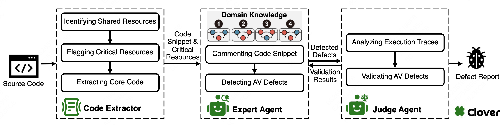

#  Automated detection of atomicity violations in large-scale systems

    <a href="https://arxiv.org/pdf/2504.00521">

## About

This project provides a modular, extensible Python framework for detecting atomicity violations (such as RWW, WWR, RWR, WRW patterns) in C code for embedded/interrupt-driven systems, using a multi-agent architecture and prompt engineering best practices.

Features
Multi-Agent: Expert and Judge agents interact and reason step by step.

Prompt-Driven: All prompts are written in Markdown, categorized by role and scenario, and easily editable.

Modular Design: Code is separated into logical modules for configuration, parsing, API interaction, and agents.

Easy Extension: Adding new atomicity patterns, prompts, or agent types is straightforward.

Reproducible and Maintainable: Central configuration, reusable utilities, and file-based prompt management for maximum transparency.

Directory Structure
multiagent_defect_analysis/
├── main.py
├── config.py
├── utils.py
├── code_parser.py
├── defect_patterns.py
├── agent_base.py
├── expert_agent.py
├── judge_agent.py
├── api_client.py
├── output.py
├── prompt/
│   ├── common/
│   │   └── system_message.md
│   ├── expert/
│   │   ├── task_objective.md
│   │   ├── detection_rules.md
│   │   ├── rww_example.md
│   │   ├── wwr_example.md
│   │   ├── rwr_example.md
│   │   └── wrw_example.md
│   └── judge/
│       ├── judge_steps.md
│       ├── judge_example_1.md
│       └── judge_example_2.md
└── README.md
Getting Started
1. Prerequisites
Python 3.8+

Access to the specified LLM API (set your API key in config.py)

Your C code, JSON, and defect report files organized according to your needs

2. Configuration
Edit config.py to set:

API endpoint and model

Your API key/authorization

Paths for code, input, and output files

3. Prompts
All prompts are stored as Markdown files in the prompt/ directory and grouped by agent/role.
You can freely edit or expand these files without changing Python code.

4. Running
Run the main process:

bash

python main.py
Outputs and intermediate results will be saved in the directories specified in config.py.

Adding a New Pattern
To add a new atomicity violation pattern (e.g., "XYZ"):

Add the pattern to defect_patterns.py with a unique key, name, and prompt markdown filename.

Create a new markdown prompt (e.g., prompt/expert/xyz_example.md) explaining and exemplifying the pattern.

That's it—the system will pick it up automatically in your analysis flow.

Prompt Engineering
All prompts use Markdown for rich formatting.

Variable fields (e.g. {pattern_name}) can be interpolated via load_prompt utility.

Prompts are version-controllable, reusable, and easily testable.

Example Agent Flow
Expert Agent receives the code, the task prompt, and detailed rules for a specific pattern, analyzes for possible defects.

Judge Agent reviews each potential atomicity violation, verifying actual reachability and context (conditions, interrupt enable/disable logic).

Outputs are stored with detailed step timing.

You can easily add new roles (e.g., Reviewer Agent) or extend the protocol for deeper, multi-round analysis.

Extending and Maintaining
To add new rules, examples, or agent logic, just add new markdown files and/or Python modules.

Use version control (e.g., Git) to track prompt improvements and experiment with new agent behaviors.

License
You may license this project as you see fit.

Acknowledgments
This structure is inspired by best practices in Prompt Engineering and modular agent orchestration.

For questions or contributions, feel free to open an issue or pull request.

Let me know if you want a more technical or minimal version, or if you want example screenshots, usage cases, etc!# clover
# clover
