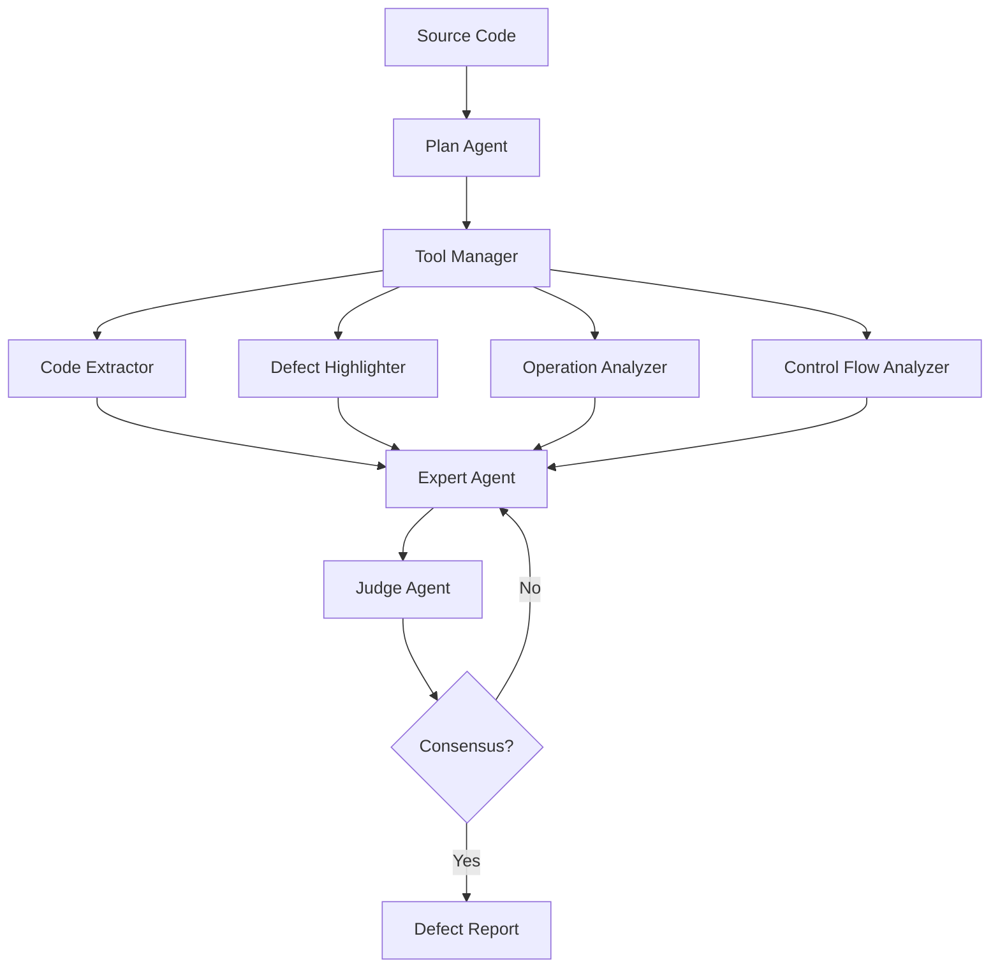
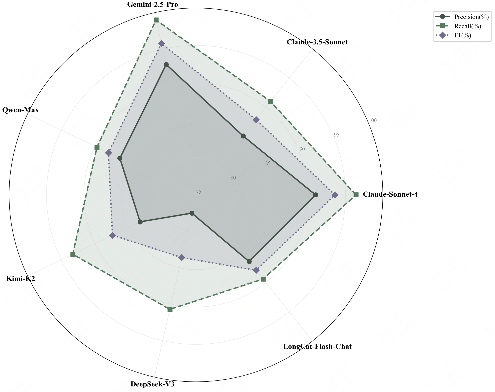

#  Clover: Automated Detection of Atomicity Violations in Interrupt-Driven Systems

<p align="center">
    <!-- <a href="https://arxiv.org/pdf/2504.00521"></a>
    <a href="https://huggingface.co/datasets/ahang518/Racebench"></a> -->
    
    
</p>


## 🎯 About

**Clover** is a cutting-edge framework that integrates **static analysis tools** with **collaborative LLM agents** to detect atomicity violations in interrupt-driven embedded systems. Through iterative multi-agent collaboration, it addresses the fundamental challenges of concurrency bug detection in critical applications where traditional approaches fall short due to:

- **Vast program state spaces** in interrupt-driven environments
- **Complex inter-function dependencies** across ISR boundaries  
- **Domain-specific knowledge** required for embedded system analysis
- **High false-positive rates** in existing static analysis tools

> [!NOTE]
> **Data Availability**: The atomic violation data for closed-source projects mentioned in the paper is not included in this repository due to licensing restrictions. For open-source benchmark evaluation, please refer to the [SV-COMP](https://sv-comp.sosy-lab.org/) and [Racebench](https://github.com/chenruibuaa/racebench) datasets included in the `/data` directory.

### Key Innovation
Clover employs a **multi-agent collaborative framework** with iterative refinement:
1. **Plan Agent** - Orchestrates program analysis tool selection and subsequent agentic workflow
2. **Expert Agent** - Generates atomicity violation defect reports based on domain knowledge
3. **Judge Agent** - Validates detected defect reports through execution trace analysis
4. **Iterative Refinement** - Expert and Judge agents collaborate until consensus or iteration limit

> [!IMPORTANT]
> 🚧 **Active Development**: We are continuously improving documentation and adding new features. Stay tuned for updates!


## ✨ Key Features

- **🤖 Multi-Agent Architecture**: Expert and Judge agents collaborate through structured reasoning
- **📝 Prompt-Driven Design**: Markdown-based prompts, categorized by role and easily customizable
- **🧩 Modular Framework**: Clean separation of concerns with logical module organization
- **🔧 Easy Extension**: Straightforward addition of new atomicity patterns and agent types
- **🔄 Reproducible Results**: Centralized configuration and transparent prompt management
- **🎯 High Precision**: Advanced filtering reduces false positives significantly

## 🚀 Quick Start

### Prerequisites
- **Python 3.10+**
- **LLVM 10.0.0** (for static analysis)
- **Conda** (recommended for environment management)
- **API Credentials** (for online LLM models) or **Local Model Setup** (for offline usage)

### Installation

**Step 1: Environment Setup**
```bash
git clone https://github.com/your-repo/clover.git
cd clover

# Create and activate conda environment
conda create -n clover python=3.10 -y
conda activate clover

# Install Python dependencies
pip install -r requirements.txt
```

**Step 2: LLVM Installation**
```bash
# Download required components (using official LLVM releases)
wget https://github.com/llvm/llvm-project/releases/download/llvmorg-10.0.0/llvm-10.0.0.src.tar.xz
wget https://github.com/llvm/llvm-project/releases/download/llvmorg-10.0.0/clang-10.0.0.src.tar.xz
wget https://github.com/Kitware/CMake/releases/download/v3.13.0/cmake-3.13.0-Linux-x86_64.tar.gz

# Extract archives
tar -xf llvm-10.0.0.src.tar.xz
tar -xf clang-10.0.0.src.tar.xz  
tar -xf cmake-3.13.0-Linux-x86_64.tar.gz

# Setup LLVM structure
mv clang-10.0.0.src llvm-10.0.0.src/tools/clang
export PATH=/path/to/cmake-3.13.0-Linux-x86_64/bin:$PATH

# Build LLVM (this takes time!)
mkdir /path/to/llvm-build-10 && cd /path/to/llvm-build-10
cmake -G "Unix Makefiles" \
  -DCMAKE_BUILD_TYPE=Release \
  -DCMAKE_INSTALL_PREFIX=/path/to/llvm-10.0.0 \
  ../llvm-10.0.0.src

make -j$(nproc) && make install
```

**Step 3: Build Analysis Tools**
```bash
cd clover/tool/Operation_Analyzer

clang++ main.cpp tool.cpp cJSON.c -o analyzer \
  `llvm-config --cxxflags --ldflags --libs all` \
  -I. -std=c++17 \
  -lstdc++ -lz -lrt -ldl -lpthread -lm
```

**Step 4: Configure API Settings**
```bash
# Edit config.py to set up your API configuration
# IMPORTANT: Update the following parameters in config.py:

# 1. Choose model type: 'local' or 'online'
MODEL_TYPE = "online"  # Set to "local" if using local models

# 2. Configure API settings (for online models)
API_HOST = "your-api-host"
API_MODEL = "your-preferred-model"

# 3. Add your API keys
API_KEYS = [
    "your-api-key-1",
    "your-api-key-2",
    # Add more keys as needed
]

# 4. Configure agent models (optional)
AGENT_MODELS = {
    "plan": "your-plan-model",
    "expert": "your-expert-model", 
    "judge": "your-judge-model"
}

# 5. Set dataset and output paths
BASE_SRC_PATH = './data/'  # Input dataset path
RESPONSE_PATH = './output/'        # Output results path
```

> [!WARNING]
> **API Configuration Required**: You must configure your API settings in `config.py` before running Clover. The current config file contains placeholder values that need to be replaced with your actual API credentials and preferred models.

**Step 5: Run Clover**
```bash
# Return to project root
cd ../../..

# Run the framework
python main.py
```

### Example Usage
```bash
# 1. First, ensure config.py is properly configured with your API settings

# 2. Analyze a C source file
clang -O0 -g -emit-llvm -S target_file.c -o target_file.ll
opt -O2 target_file.ll -S -o target_file-opt.ll

# 3. Run Clover analysis
python main.py --input target_file.c --output results/
```

> [!TIP]
> **Before running**: Double-check that your `config.py` file has been properly configured with valid API credentials and model settings. The framework will not work with the default placeholder values.

## 🏗️ Architecture

### Framework Overview

```mermaid
graph TD
    A[Source Code] --> B[Plan Agent]
    B --> C[Tool Manager]
    C --> D[Code Extractor]
    C --> E[Defect Highlighter] 
    C --> F[Operation Analyzer]
    C --> G[Control Flow Analyzer]
    D --> H[Expert Agent]
    E --> H
    F --> H
    G --> H
    H --> I[Judge Agent]
    I --> J{Consensus?}
    J -->|No| H
    J -->|Yes| K[Defect Report]
```

### Multi-Agent Collaborative Architecture

#### 1. **Plan Agent**
- **Workflow Strategy**: Coordinates task management and agent interaction
- **Tool Selection**: On-demand invocation of static analysis tools
- **Code Summary**: Provides contextual information for subsequent agents

#### 2. **Static Analysis Tools** (Tool Manager)
- **Code Extractor**: Identifies shared resources and extracts critical code snippets
- **Defect Highlighter**: Enhanced pattern matching with semantic array index analysis
- **Operation Analyzer**: Memory access pattern detection and classification
- **Control Flow Analyzer**: Basic block-level path analysis and loop detection

#### 3. **Expert Agent**
- **Domain Knowledge**: Embedded systems and interrupt-driven programming expertise
- **AV Pattern Recognition**: Identifies <R,W,R>, <W,R,W>, <W,W,R>, and <R,W,W> violation patterns
- **Defect Report Generation**: Creates structured violation reports with evidence

#### 4. **Judge Agent**
- **Execution Trace Validation**: Analyzes program execution paths and feasibility
- **Evidence Assessment**: Validates expert findings through trace analysis
- **Iterative Refinement**: Collaborates with Expert Agent until consensus

## 📁 Project Structure

```
clover/
├── 📄 main.py                        # Main entry point
├── ⚙️ config.py                      # Configuration management (⚠️ MUST BE CONFIGURED)
├── 🛠️ utils.py                       # Utility functions
├── 📊 code_parser.py                 # Code parsing logic
├── 🔍 defect_patterns.py             # Atomicity violation patterns
├── 🌐 api_client.py                  # LLM API client
├── 🤖 agent/                         # Multi-agent system
│   ├── agent_base.py                # Base agent class
│   ├── plan_agent.py                # Planning agent
│   ├── conversation_manager.py      # Conversation management
│   └── judge_agent.py               # Validation agent
├── 🔧 preprocessing/                 # Code preprocessing
│   ├── core/                        # Core functionality
│   ├── analyzers/                   # Analysis modules
│   └── tests/                       # Unit tests
├── 💬 prompt/                        # LLM prompt templates
│   ├── common/                      # Shared prompts
│   ├── expert/                      # Expert agent prompts
│   └── judge/                       # Judge agent prompts
├── 🔍 tool/                          # Static analysis tools
│   ├── Code_Extractor/             # Shared resource identification
│   ├── Defect_Highlighter/         # Enhanced pattern matching
│   ├── Operation_Analyzer/         # Memory access analysis  
│   ├── Control_Flow_Analyzer/      # Basic block analysis
│   └── runner.py                   # Tool manager and orchestrator
├── 📊 data/                       # Benchmark datasets
├── 📊 result/                        # Experimental evaluation results
│   ├── ablation_study.xlsx          # Component-wise performance analysis
│   ├── comparative_study.xlsx       # Comparison with state-of-the-art tools
│   └── different_LLMs.xlsx          # LLM performance comparison
├── 📈 results/                       # Analysis outputs and generated results
├── 📋 requirements.txt               # Dependencies
└── 🔍 analyze_response_times.py      # Response time analysis tool
```

## 🔬 Technical Highlights

### Enhanced Static Analysis Tools
- **Semantic Array Index Matching**: Handles `arr[i]` vs `arr[9999]` equivalence in loops
- **TRIGGER Value Recognition**: Identifies test-specific access patterns  
- **Control Flow Precision**: Distinguishes mandatory vs conditional operations
- **ISR-Aware Analysis**: Embedded system interrupt handling expertise

### Multi-Agent Workflow
- **Iterative Collaboration**: Expert and Judge agents repeat analysis until consensus
- **Domain-Specific Reasoning**: Embedded systems knowledge integrated throughout
- **Conversation Management**: Structured dialogue between agents with result tracking
- **Adaptive Tool Selection**: Plan agent selects appropriate analysis tools on-demand

## 📊 Evaluation

Clover has been evaluated on:
- **SV-COMP Benchmarks**: Industry-standard concurrency datasets
- **Real-world Embedded Systems**: Production interrupt-driven applications
- **Comparative Analysis**: Against state-of-the-art static analysis tools

### LLM Performance Comparison

<p align="center">
  
</p>

Our evaluation across different LLM models shows that Clover achieves consistently high performance with various state-of-the-art models, with Claude-Sonnet-4 and Gemini-2.5-Pro showing the best overall performance.

Key improvements:
- **🎯 Higher Precision**: 40%+ reduction in false positives
- **🔍 Better Recall**: Enhanced detection of complex violation patterns  
- **⚡ Practical Applicability**: Handles large-scale embedded codebases

> [!NOTE]
> **📊 Detailed Results Available**: Comprehensive experimental data, including ablation studies, comparative analysis, and LLM performance comparisons, are available in the [`/result`](./result/) directory with full documentation and reproducibility instructions.

## 🤝 Contributing

We welcome contributions! Please see our [Contributing Guidelines](CONTRIBUTING.md) for details.

### Development Setup
```bash
# Install development dependencies
pip install -r requirements-dev.txt

# Run tests
python -m pytest preprocessing/tests/

# Code formatting
black . && isort .
```

## 🙏 Acknowledgments

We sincerely thank the following projects for their valuable contributions:
- [**Racebench**](https://github.com/chenruibuaa/racebench) - Benchmark datasets
- [**CPA4AV**](https://github.com/BinYu-Xidian-University/CPA4AV) - Atomicity violation detection
- [**intAtom**](https://github.com/wangilson/Atom) - Interrupt-aware analysis

## 📄 License

This project is licensed under the MIT License - see the [LICENSE](LICENSE) file for details.

---
<p align="center">
  <b>🌟 Star us on GitHub if you find Clover useful! 🌟</b>
</p>
